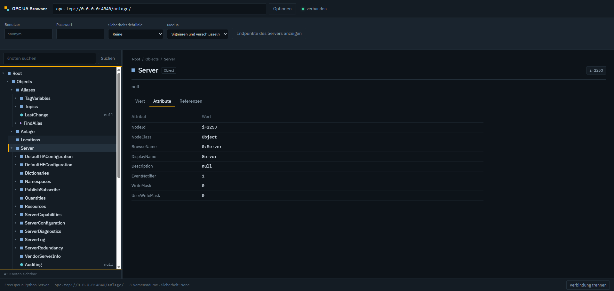

# OPC UA Browser

Adressraum einer Steuerung im Browser durchsehen: Endpunktadresse eingeben
(`opc.tcp://x.x.x.x:4840`), links wächst der Knotenbaum, in der Mitte stehen
Wert, Attribute und Referenzen des ausgewählten Knotens.



## Starten

```bash
docker compose --profile demo up --build     # Browser + simulierte Anlage
```

Danach <http://localhost:8080> öffnen und `opc.tcp://demo:4840/anlage/` eintragen
(die Demo-Anlage läuft als zweiter Container). Ohne Demo:

```bash
docker compose up --build                    # nur der Browser
```

Einzeln, ohne Compose:

```bash
docker build -t opcua-browser .
docker run --rm -p 8080:8080 -v opcua-certs:/data opcua-browser
```

Ohne Docker, zum Entwickeln:

```bash
pip install -r requirements.txt
uvicorn app.main:app --reload --port 8080
python demo/demo_server.py        # optional, in einem zweiten Terminal
```

## Netzwerk

Der Container muss die Steuerung erreichen. Liegt die SPS in einem eigenen
Anlagennetz, ist meist `network_mode: host` der kürzeste Weg (Linux):

```yaml
services:
  browser:
    network_mode: host
```

OPC UA antwortet beim Verbinden mit der Endpunktadresse, die der Server über sich
selbst kennt. Nennt er einen internen Hostnamen, den der Container nicht auflösen
kann, hilft ein Eintrag unter `extra_hosts` in der `docker-compose.yml`.

## Bedienung

- **Baum**: Klick auf den Pfeil klappt auf, Klick auf den Namen wählt aus,
  Doppelklick tut beides. Neben jeder Variablen steht ihr aktueller Wert.
- **Tastatur**: Pfeil hoch/runter bewegt die Auswahl, Pfeil rechts klappt auf,
  Pfeil links klappt zu oder springt zum Elternknoten, Pos1/Ende an den Rand.
- **Symbole**: ausgefülltes Quadrat = Object, Kreis = Variable, Dreieck = Method,
  Raute = Typknoten, hohles Quadrat = View.
- **Statuslampe**: grün = Good, orange = Uncertain, rot = Bad – nach dem
  Statuscode, den der Server zum Wert liefert.
- **Laufend aktualisieren**: pollt den ausgewählten Wert im gewählten Abstand und
  zeichnet aus Zahlen und Bool-Werten einen kleinen Verlauf.
- **Schreiben**: nur bei Variablen mit `CurrentWrite` im UserAccessLevel. Das Feld
  nimmt `true`/`false`, Zahlen mit Punkt oder Komma, `0x1F`, ISO-Zeitstempel und
  für Arrays eine Liste wie `[true, false, true]`.
- **Suchen**: durchsucht Anzeige- und Browsenamen breitensuchend ab dem
  Wurzelknoten. Ein Treffer klappt den Baum bis zum Knoten auf.
- **Optionen**: Benutzer/Passwort und Sicherheitsrichtlinie. „Endpunkte des
  Servers anzeigen“ fragt vor dem Verbinden ab, welche Richtlinien und
  Anmeldearten der Server anbietet.

## Sicherheit

Ohne Richtlinie verbindet der Browser anonym und unverschlüsselt – üblich im
abgeschotteten Anlagennetz, aber ein Passwort ginge dabei im Klartext über die
Leitung. Wählst du `Basic256Sha256`, `Aes128Sha256RsaOaep` oder
`Aes256Sha256RsaPss`, erzeugt der Dienst beim ersten Mal selbst ein
Client-Zertifikat unter `/data/certs` (im Compose-Setup ein benanntes Volume,
damit es Neustarts übersteht). Dieses Zertifikat musst du im Server einmalig als
vertrauenswürdig markieren – bei den meisten Steuerungen liegt es danach in der
Liste der abgelehnten Zertifikate und wird dort freigegeben.

Der Dienst hat selbst keine Anmeldung. Er gehört nicht ungeschützt ins offene
Netz: entweder nur lokal binden oder einen Reverse Proxy mit Anmeldung davor.

## Einstellungen

| Variable                     | Vorgabe       | Wirkung                                        |
| ---------------------------- | ------------- | ---------------------------------------------- |
| `OPCUA_READ_ONLY`            | `false`       | `true` sperrt jedes Schreiben, auch im Backend  |
| `OPCUA_SESSION_IDLE_TIMEOUT` | `1800`        | Sekunden, bis eine untätige Verbindung fällt    |
| `OPCUA_MAX_SESSIONS`         | `20`          | gleichzeitig offene Serververbindungen          |
| `OPCUA_CERT_DIR`             | `/data/certs` | Ablage für Client-Zertifikat und Schlüssel      |
| `OPCUA_APPLICATION_URI`      | `urn:opcua-browser:client` | URI im Zertifikat und im Session-Namen |
| `LOG_LEVEL`                  | `INFO`        | `DEBUG` zeigt jeden UA-Aufruf                   |

Für ein Anlagennetz, in dem niemand versehentlich einen Sollwert verstellen soll:

```yaml
environment:
  OPCUA_READ_ONLY: "true"
```

## Aufbau

```
app/main.py         REST-Schnittstelle: browse, node, values, write, references, search
app/sessions.py     Verbindungen aufbauen, halten, nach Leerlauf schließen, Zertifikat
app/ua_json.py      OPC-UA-Typen nach JSON: Varianten, Statuscodes, Zeitstempel
app/static/         Oberfläche ohne Framework (index.html, style.css, app.js)
demo/demo_server.py Simulierte Anlage: Ofen, Förderband, Tank, Diagnose, Methode
```

Die Schnittstelle ist bewusst schlank gehalten und lässt sich auch ohne die
Oberfläche nutzen:

```bash
SID=$(curl -s -X POST localhost:8080/api/connect \
  -H 'Content-Type: application/json' \
  -d '{"url":"opc.tcp://127.0.0.1:4840/anlage/"}' | jq -r .sessionId)

curl -s "localhost:8080/api/sessions/$SID/browse?nodeId=i%3D85" | jq
curl -s "localhost:8080/api/sessions/$SID/values?nodeId=ns%3D2%3Bi%3D4" | jq
curl -s -X POST "localhost:8080/api/sessions/$SID/write" \
  -H 'Content-Type: application/json' \
  -d '{"nodeId":"ns=2;i=5","value":"195,5"}' | jq
curl -s -X DELETE "localhost:8080/api/sessions/$SID"
```

Die vollständige Beschreibung erzeugt FastAPI selbst unter `/docs`.

## Grenzen

- Gelesen wird durch Abfragen, nicht über Subscriptions. Für schnelle Signale
  unterhalb einiger hundert Millisekunden ist das der falsche Weg – dafür wäre
  eine Subscription mit WebSocket zur Oberfläche der nächste Schritt.
- Methoden werden angezeigt, aber nicht aufgerufen. Auf einer laufenden Anlage
  ist ein Methodenaufruf aus einem Browser heraus schnell folgenschwer.
- Historische Werte (HistoryRead) und Alarme sind nicht enthalten.
- Die Suche läuft breitensuchend über höchstens 6000 Knoten und bricht nach
  20 Sekunden ab. Bei sehr großen Adressräumen lieber weiter unten im Baum
  ansetzen.
